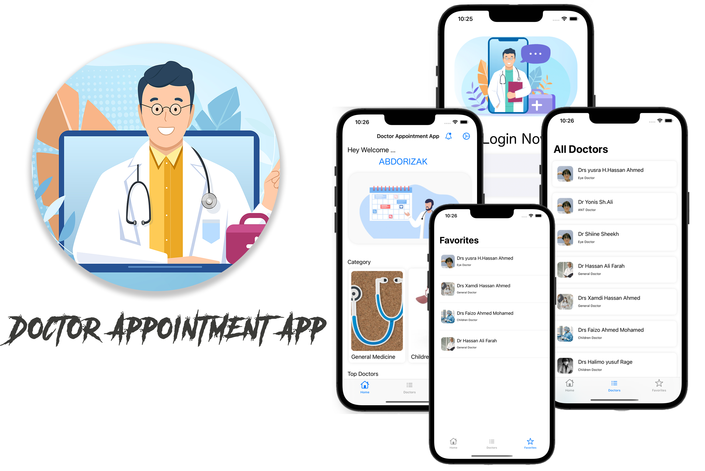

# <h1 align="center"> Doctor Appointment App </h1>

### Overview
This is simple app It also connects patients with doctors by requesting there Favorite doctor, whether they have insurance in place or not. It also offers 24/7 access to quality care with face-to-face visits.

### Screenshots

### Installation 🛠
- Clone / download this repository.
- change the bundle identifier in project settings.
- run the app.
- requires xcode 12.0 +

### Includes ( ALL SWift UiKit )
- Storyboard.
- using Native Apple APIs to request Web Api's.
- Table View.
- Collection View.
- Custom Views, and Date Picker.
- Node JS, Express, MongoDB, Backend.

## Author
**ABDORIZAK ABDALLA HASSAN** aka xMan

<h4 align="center"> © Doctor Appointment App || 2021</h4>
